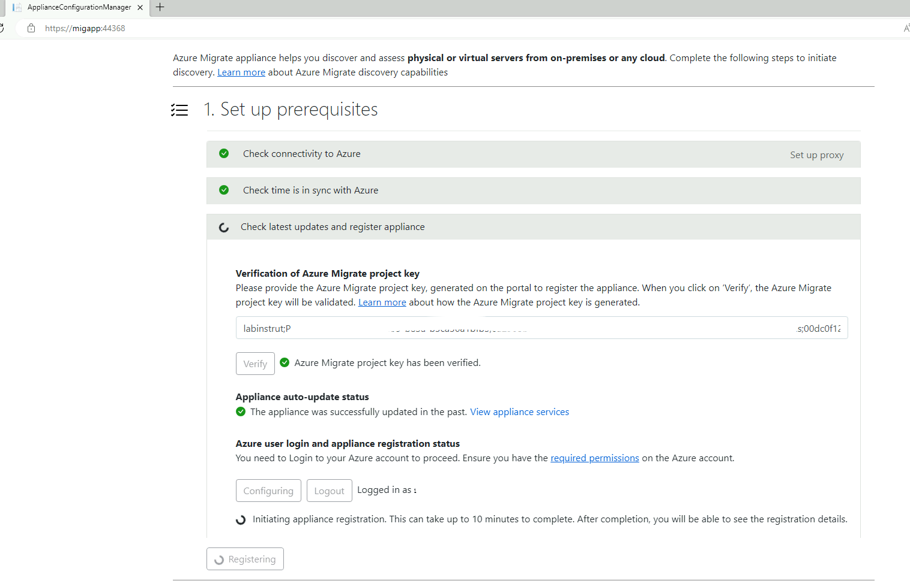

# Assess the lab with Azure Migrate

## Deploy the Azure lab

The first thing that you need to do is deploy the Azure virtual machine (VM) that will act as your on-prem environment.  You can start the deployment via the following button: 

_It can take 50-70 minutes for the lab to fully deploy._

# Table of contents

- [Set up the lab](#set-up-the-lab)
- [Build a server to install Azure Migrate on](#discover-with-azure-migrate)
- [Configure remote access on servers](#configure-remote-access-on-servers)
- [Create an Azure Migrate project](#create-an-azure-migrate-project)
- [Install the Azure Migrate appliance](#install-the-azure-migrate-appliance)
- [Configure the Azure Migrate appliance - Azure connection](#configure-the-azure-migrate-appliance---azure-connection)
- [Configure the Azure Migrate appliance - Manage credentials and discovery sources](#configure-the-azure-migrate-appliance---manage-credentials-and-discovery-sources)

## Set up the lab

Once the Azure deployment has completed, there are a few things you need to do within the lab before you can start using it. 

* Log onto your Azure VM
* Launch Hyper-V
* Log onto AD01, the login name is **tailwindtraders\administrator** and the password is: demo@pass123 
* Configure the IP address to a static one, the configuration should be: 
    - IP Address: 192.168.0.2
    - Subnet Mask: 255.255.255.0
    - Default Gateway: 192.168.0.1
    - Preferred DNS: 127.0.0.1
    - Alternative DNS: 8.8.8.8
* For the other winodws servers configure the IP addresses as follows:

|  VM Name  | IP Address   | Subnet   |  Default Gateway | Preferred DNS | Alternative DNS |
|---|---|---|---|---|---|
|  AD01 |  192.168.0.2 | 255.255.255.0   |  192.168.0.1 | 192.168.0.2 | 8.8.8.8 |
|  FS01 | 192.168.0.3   | 255.255.255.0  |   192.168.0.1 | 192.168.0.2 | 8.8.8.8 |
| SQL01  | 192.168.0.4   | 255.255.255.0  |  192.168.0.1 | 192.168.0.2 | 8.8.8.8  |
| WEB01  | 192.168.0.5   | 255.255.255.0  |   192.168.0.1 | 192.168.0.2 | 8.8.8.8 |
* Log onto the Hyper-V Manager, right click on WEB02 and select **Delete** _This lab currently doesn't work using this Linux server._

## Discover with Azure Migrate

We are going to deploy Azure Migrate within our lab environment to assess the servers and look start the process for a migration.  Because we can't access the hypervisor layer we are going to treat our servers as if they were physical servers and deploy Azure Migrate in that manner. 

### Build a server to install Azure Migrate on

We need to build a server that can host the Azure Migrate software within our environment.  

* Obtain an ISO for Windows Server 2022 and store it within your Azure VM - if you have an MSDN subscription you can download the ISO from [https://my.visualstudio.com/](https://my.visualstudio.com/)
* Open **Hyper-V Manager** within your Azure VM
* From the **Action** pane, click **New**, and then click **Virtual Machine**
* From the **New Virtual Machine Wizard**, click **Next**
* You will be asked to provide some information on the server:
    * Name
    * Generation: Specify Generation 1
    * Memory: Assign at least 16GB of memory
    * Networking: Select
    * Hard Disk: Specify at least 80GB
    * Select the Windows Server 2022 ISO for the operation system
* After verifying your choices in the **Summary** page, click **Finish**
* Once the VM is created, within the **Hyper-V Manager** tool, right click on the new VM
* Select **Settings**
* Ensure 8 virtual processors are assigned to the VM
* Click **OK**
* Now right click on the VM and select **Start**
* Walk through the process of installing the operating system
* When the VM has installed the operating system, we need to configure some settings within the VM
* Within the **Server Manager** click on **Local Server**
* Click on the **Computer Name** and give the server an appropriate name, click **OK** and restart the server
* When the VM restarts, within the **Server Manager** click on **Local Server**
* Click on the **IE Enchanced Security Configuration** setting and ensure it is turned off
* Now click on the **Ethernet** setting to launch the networking configuration window
* Right click on the network adapter and select **Properties**
* Click on **Internet Protocol Version 4 (TCP/IPv4)** and select **Properties**
* Configure the IP address to a static one, the configuration should be: 
    - IP Address: 192.168.0.7
    - Subnet Mask: 255.255.255.0
    - Default Gateway: 192.168.0.1
    - Preferred DNS: 192.168.0.2
    - Alternative DNS: 8.8.8.8
* When the server restarts ithin the **Server Manager** click on **Local Server**
* Click on **Workgroup**
* You want to join the server to the **tailwindtraders** domain
* Restart the server as prompted

## Configure remote access on servers

_We need to ensure that Azure Migrate can access the servers through WinRM for the Windows Servers._

* Log onto each of the Windows servers (AD01, FS01, SQL01, WEB01) and run the following commands:
    - Enable-PSRemoting -Force
    - winrm quickconfig

### Create an Azure Migrate project
_For the purpose of this lab environment we're going to assume that AS01, FS01, SQL01, WEB01 and WEB02 are all physical servers._

* In the Azure portal > All services, search for **Azure Migrate**
* In Overview, select **Create project**
* In Create project, select your Azure subscription and resource group. Create a resource group if you don't have one
* In Project Details, specify the project name and the geography in which you want to create the project
* Select Create
* When the Azure Migrate project creates, you can now start to deploy the Azure Migrate appliance.  To do this select **Discover** under Azure Migrate: Discovery and Assessment
* On the Discover screen ensure you select **Physical or other** from the type of servers you are discovering
* Input a name for your appliance and select **Generate Key**, make sure you don't leave this page until the key is generated
* Take a copy of your project key and store it somewhere safe, you need this later on
* Next you need to download the Azure Migrate appliance.  Displayed on the page should be a download button, ensure you  download the .zip file as displayed onto the server you have just built.

### Install the Azure Migrate appliance
* Once the .zip file has downloaded, be sure to **unzip** it before carrying on
* You can follow the official documentation to verify the security of the file you have just downloaded.  The steps and verification process can be found [here](https://learn.microsoft.com/azure/migrate/tutorial-discover-physical#verify-security)
* Launch **PowerShell** on the server with administrative (elevated) privilege
* Change the PowerShell directory to the folder where the contents have been extracted from the downloaded zipped file
* Run the command **.\AzureMigrateInstaller.ps1**
* You will be prompted to answer certain questions. Within this example you want to select:
      - Physical Servers
      - Azure Public cloud
      - Default (public endpoint)
* The installer script does the following:
    - Installs agents and a web application.
    - Installs Windows roles, including Windows Activation Service, IIS, and PowerShell ISE.
    - Downloads and installs an IIS rewritable module.
    - Updates a registry key (HKLM) with persistent setting details for Azure Migrate.
    - Creates the following files under the path:
        - Config Files: %ProgramData%\Microsoft Azure\Config
        - Log Files: %ProgramData%\Microsoft Azure\Logs

* After the script has executed successfully, the appliance configuration manager will be launched automatically.

### Configure the Azure Migrate appliance - Azure connection

* Double click on the **Azure Migrate appliance icon** that is installed on your desktop
* **Accept the license terms**, and read the third-party information
* The Appliance will check it has internet access and connect with the Azure portal, you have the option to add a proxy configuration here if needed
* The Appliance will then check the time with the server and the Internet
* The first manual step you have is to paste in the key that you got earlier from the Azure portal when you were creating the Azure Migrate project.  Once you input the key, click **verify**. 
* The Azure Migrate appliance will verify the key and also check for any updates to the appliance.  It's worth while giving this 5-10minutes to run before trying to move on. 
* The next step is to **Login**.  When you click on that button it will generate a Device Code you can use to log into the Azure portal via [https://aka.ms/devicelogin](https://aka.ms/devicelogin)
* Once you confirm your credentials it will take up to 10minutes to complete the registration process.  Once this is completed we can move onto the next step. 

### Configure the Azure Migrate appliance - Manage credentials and discovery sources

Now that the Azure Migrate appliance is connected to your Azure Migrate project within Azure it's time to tell it how and where to look for servers and start to gather information about your environment. 

_It's worth noting we are going through the process of discovering physical servers, the process will be different when trying to discover a Hyper-V or VMware environment._

We need to add credentials that have rights to be able to discover the servers. _Within a production environment you would set up a specific account to do the discovery with the minimum required permissions, but in this lab environment we are going to use the global admin account for simplicity._

* Click on **Add Credentials**
* Within the pop up box enter
    - Source Type: Windows Server
    - Friendly Name: windowsadmin
    - Username: tailwindtraders\administrator
    - Password: demo@pass123 _If you've changed the default password for this lab be sure to add it._
* Click on **Save**
* Click on **Add discovery source**
* Select **Add multiple items**
* Within the text box enter: 
    - 192.168.0.2, windowsadmin
    - 192.168.0.3, windowsadmin
    - 192.168.0.4, windowsadmin
    - 192.168.0.5, windowsadmin
* Click on **verify**
_If you receive any errors, try and discover the server with it's name rather than IP address._
* Once the servers have validated we can can configure the Azure Migrate appliance to do SQL server discovery. 
* Click on **Add Credentials**
* Within the pop up box enter
    - Credentials type: Domain Credentials
    - Friendly Name: sqladmin
    - Domain name: tailwindtraders.org
    - Username: administrator
    - Password: demo@pass123 _If you've changed the default password for this lab be sure to add it._
* You are now ready to start the discovery, click on **Start Discovery**
_You may be asked to log into Azure again at this point._

🕛 **When you click on the start discovery button it will give you an assessment as to how long it will take for the server information to appear in the portal.**

💡 **Once the servers have been discovered, you can enable Dependency Analysis within the Azure Portal following this guide: [Configure Azure Migrate to do dependency analysis on your servers](azure-migrate-dependencies.md)**