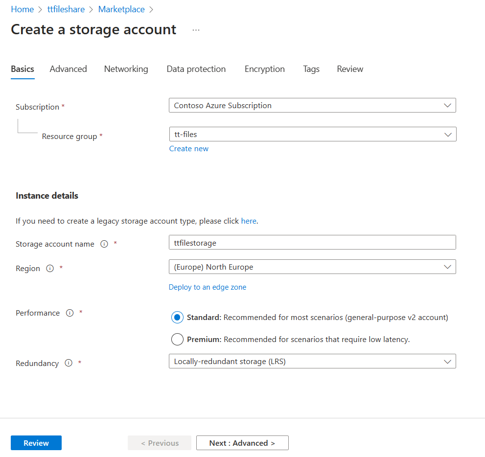
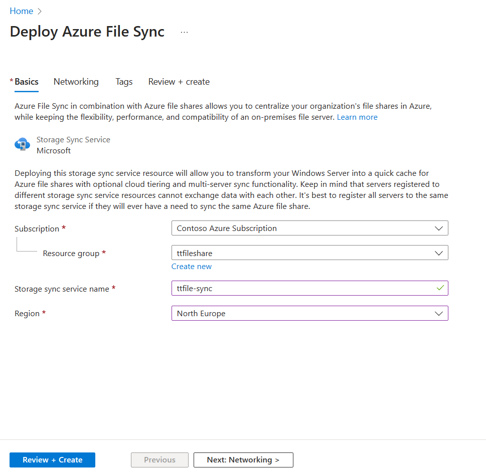
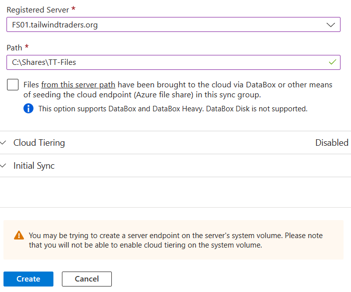

# Deploy an Azure File Share with an on-prem endpoint

# Table of contents
  * [Deploy the Azure lab](#deploy-the-azure-lab)
  * [Set up the lab](#set-up-the-lab)
  * [Configure the Azure File Share](#configure-the-azure-file-share)
    + [Create a storage account](#create-a-storage-account)
    + [Create a file share](#create-a-file-share)
    + [Deploy the Storage Sync Service](#deploy-the-storage-sync-service)
    + [Install the Azure File Sync Agent](#install-the-azure-file-sync-agent)
    + [Register Windows Server](#register-windows-server)
    + [Create a sync group](#create-a-sync-group)
    + [Add a server endpoint to your sync group](#add-a-server-endpoint-to-your-sync-group)

## Deploy the Azure lab

The first that that you need to do is deploy the Azure virtual machine (VM) that will act as your on-prem environment.  

You can click on the following button and it will take you to the Azure Portal which will walk you through the deployment of the lab via the web browser experience: 

<a href="https://portal.azure.com/#create/Microsoft.Template/uri/https%3A%2F%2Fraw.githubusercontent.com%2Fweeyin83%2FLab-Deployment-in-Azure%2Fmain%2FVMdeploy.json" target="_blank">
    
</a>

Alternatively if you would like to deploy the lab using Azure Bicep you can clone the repo and deploy the template using the following Azure PowerShell commands: 

```powershell

## Create variables - modify these to suit your deployment needs
$ResourceGroupName = "AzureLab"
$Location = "uksouth"
$BicepDeploymentName = "AzureLabDeployment"
$DNSName = "AzureLab"

## Create an Azure Resource Group
New-AzResourceGroup -Name $ResourceGroupName -Location $Location

## Deploy the Azure Lab using Bicep
New-AzResourceGroupDeployment -name $BicepDeploymentName -ResourceGroupName $ResourceGroupName -TemplateFile VMdeploy.bicep -hypervHostDnsName $DNSName
```

_It can take 50-70 minutes for the lab to fully deploy._

## Set up the lab

Once the Azure deployment has completed, there are a few things you need to do within the lab before you can start using it. 

* Log onto your Azure VM
* Launch Hyper-V
* Log onto AD01, the login name is **tailwindtraders\administrator** and the password is: **Password**: demo@pass123 
* Configure the IP address to a static one, the configuration should be: 
    - IP Address: 192.168.0.2
    - Subnet Mask: 255.255.255.0
    - Default Gateway: 192.168.0.1
    - Preferred DNS: 127.0.0.1
    - Alternative DNS: 8.8.8.8
* Restart the 4 other servers hosted within the Hyper-V environment _(Restarting them will force them all to pick up an IP address from the AD01 server)_


## Configure the Azure File Share

### Create a storage account

Before you can work with an Azure file share, you must create an Azure storage account.

* Head over to the Azure portal - [https://azure.portal.com](https://azure.portal.com)
* Under **Azure Services**, select **Storage Accounts**
* Select **+ Create** to create a storage account
* Under Project details, select the Azure subscription in which to create the storage account. If you have only one subscription, it should be the default
* If you want to create a new resource group, select Create new and enter a name such as **ttfileshare**
* Under Instance details, provide a name for the storage account. You might need to add a few random numbers to make it a globally unique name. A storage account name must be all lowercase and numbers, and must be between 3 and 24 characters. Make a note of your storage account name. You'll use it later
* In Region, select the region you want to create your storage account in
* In Performance, keep the default value of Standard
* In Redundancy, select Locally redundant storage (LRS) for the purposes of this tutorial



* Select Review to review your settings. Azure will run a final validation
* When validation is complete, select **Create**. You should see a notification that deployment is in progress

### Create a file share

Now you have a storage account, it's time to create the file share. 

* Within the Storage account you created navigate to **Data Storage** and **File Shares** 
* Select **+ File Share**
* Name the new file share **ttfileshare**, leave the tier set to Transaction optimized, and then select Create. You only need 5 TiB for this tutorial


### Deploy the Storage Sync Service

We now need to set up the Storage Sync Service so that our on-prem file share syncs with our Azure file share. 

* In the Azure Portal, select **Create a resource** and search for **Azure File Sync**
* In the search results select **Azure File Sync**
* Select Create to open the **Deploy Azure File Sync tab**
* Select your subscription
* Select the resource group
* For the **Storage Sync service name** call it something like **ttfile-sync**
* Select an appropriate region



* When you're finished, select **Review + Create** and then **Create** to deploy the Storage Sync Service. The service will take a few minutes to deploy.

### Install the Azure File Sync Agent

The Azure File Sync agent is a downloadable package that allows the Windows Server to by synced with the Azure File share. 

* Log onto FS01
* Open up a browser
* Go to [Microsoft Download Center](https://go.microsoft.com/fwlink/?linkid=858257).  Scroll down to the **Azure File Sync Agent** and select **Download**
* There is a different download for each version of Windows Server, as FS01 is a Windows Server 2012 R2 server, select the check box for **StorageSyncAgent_WS2012R2.msi** and select **Next**
* Open the file downloaded
* Select **Allow once > Run**
* Go through the **Storage Sync Agent Setup Wizard** and accept the defaults
* Select **Install**
* Select **Finish**

### Register Windows Server

You need to register your Windows server with the Storage Sync service to establish a trust relationship between the two.  A server can only be registered to one Storage Sync service at a time.  Once the sync is created it can sync with other servers and Azure file shares associated with the Storage Sync Service. 

The Server Registration UI should open automatically after you install the Azure File Sync agent. If it doesn't, you can open it manually from its file location: _C:\Program Files\Azure\StorageSyncAgent\ServerRegistration.exe_

* When the Server Registration UI opens in the VM, select Sign in
* Sign in with your Azure account credentials
* You will be asked to provide the Azure Subscription, Resource Group and Storage Sync Service that you want to register the server to
* As part of the registration process, you're prompted for an additional sign-in. Sign in and select Next
* Select OK

### Create a sync group

A sync group defines the sync topology for a set of files. A sync group must contain one cloud endpoint, which is the Azure File Share. A sync group must also contain at least one server endpoint.  A server endpoint represents a path on a registered server.

* In the Azure portal, select **+ Sync group** from the Storage Sync Service you deployed
* You will be asked to for some information:
    * Give the Sync group a name, name is something like **ttsyncgroup**
    * Select the Azure subscription
    * Select the storage account that you created earlier
    * Select the Azure file share that you created earlier


* Select **Create**

You now have a sync group with a cloud endpoint. 

### Add a server endpoint to your sync group

* Select the newly created sync group and then select **Add server endpoint**
* Within the setup you will be asked to provide information: 
    * Within the registered server box select the server, you should see FS01 as an option
    * Provide the path to where the files are on your server, in this example they are located in **C:\Shares\TT-Files**
    * You can enable Cloud Tiering if you would like to test how that works, but it is an optional setting
    * Within the **Initial Sync** setting you can leave the default options for this tutorial, but it's important to understand the options for real world examples



* Select **Create**

Within a few minutes you should start to see the file sync from your Windows server to the Azure file share. 

